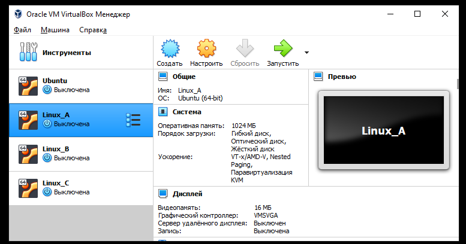
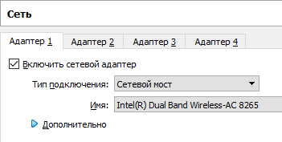
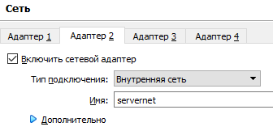
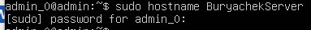
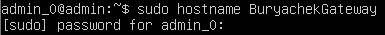
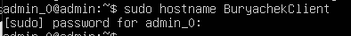
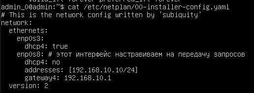

# Практическое задание №1.

1. Устанавливаем машину Ubuntu, настраиваем параметры сети Адаптер 1 и Адаптер 2 - сетевой мост и внутренняя сеть, клонируем Ubuntu 3 раза и переименовываем машина А, машина В, машина C.

2. Переименовываем хосты 3-х машин.

3. Конфигурируем файл 00-installer-config.yaml на машине А.

4. Проверяем ip a.

