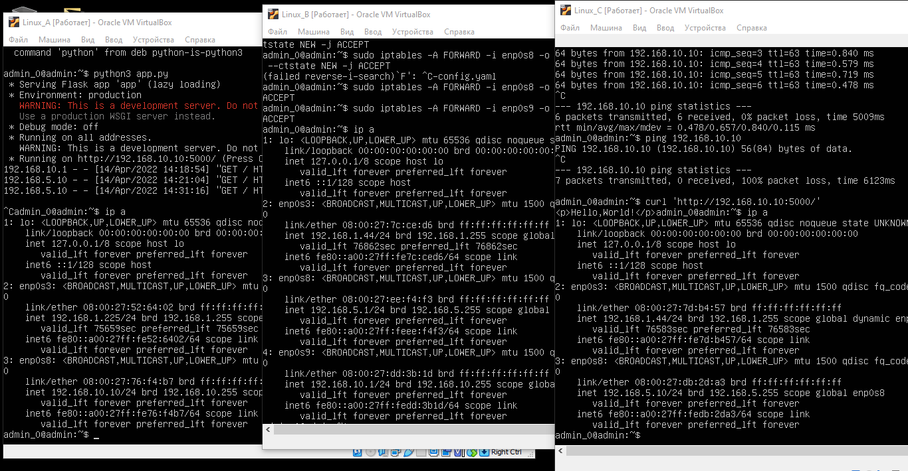

# Практическое задание №1.

1. Устанавливаем машину Ubuntu, настраиваем параметры сети Адаптер 1 и Адаптер 2 - сетевой мост и внутренняя сеть, клонируем Ubuntu 3 раза и переименовываем машина А, машина В, машина C.

2. Переименовываем хосты 3-х машин.

3. Конфигурируем файл 00-installer-config.yaml на машине А.

4. Проверяем ip a.

5.	Конфигурируем файл 00-installer-config.yaml на машине В.

6. Проверяем ip a.

7.	Конфигурируем файл 00-installer-config.yaml на машине C.

8. Проверяем ip a.

9. Конфигурация маршрутов машина В.

10. Сохраняем правила.

11. Создаем файл app.py на машине А.

12. Редактируем файл

13.	Перезапускаем службу и активируем автозагрузку.

14. На машине С запускаем команду.

15. Настройки сети всех 3-х машин. 

